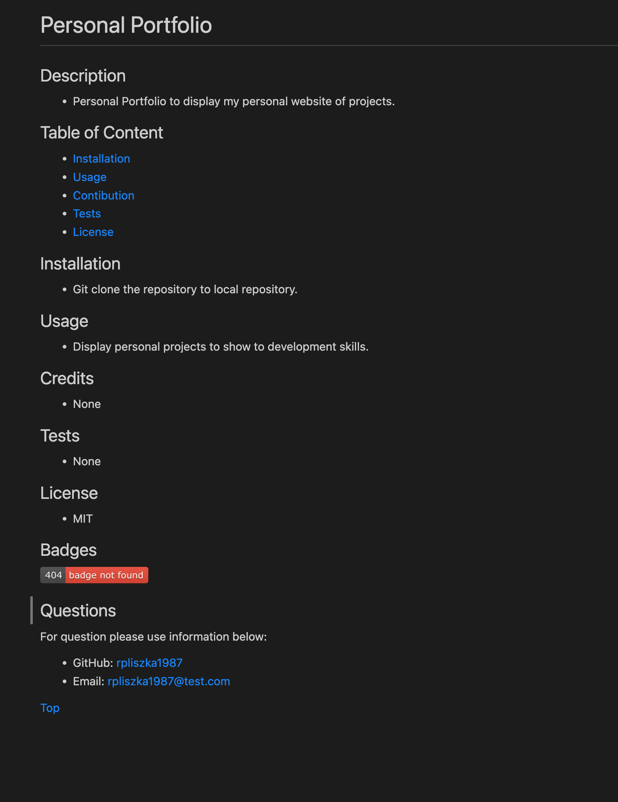

# README generator

## Description

- This application can be used to generate a README file for your repository

## Table of Content

- [Usage](#usage)
- [Screenshot](#screenshot)
- [Video-Link](#video-link)
- [GitHub-repo](#github-repo)

## Usage

- Clone the repository into local directory.
- This application is used by running in the terminal.
- Open application in terminal or VS Code.
- Run $ npm install to install all dependencies.
- Rung $ node index to start the application.
- New file will be generated in utils/ directory.

## Screenshot

## Video-Link

- https://drive.google.com/file/d/1XDMJUDPTHrRMCtP8b4OC6FwJHU5I_7Kx/view

## GitHub-Repo

- https://github.com/rpliszka1987/readme-generator
